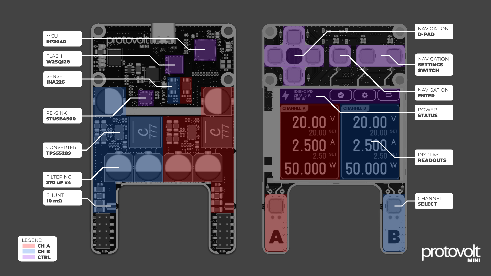
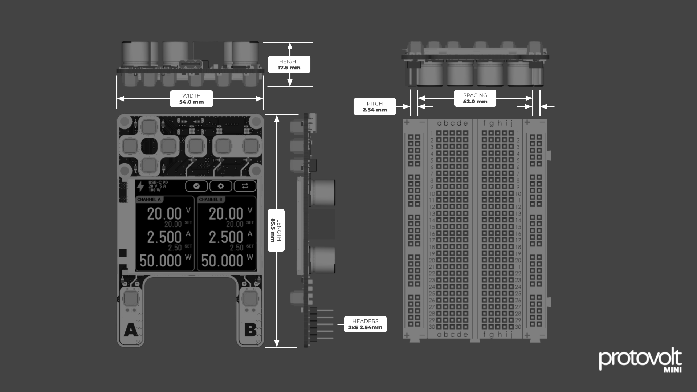
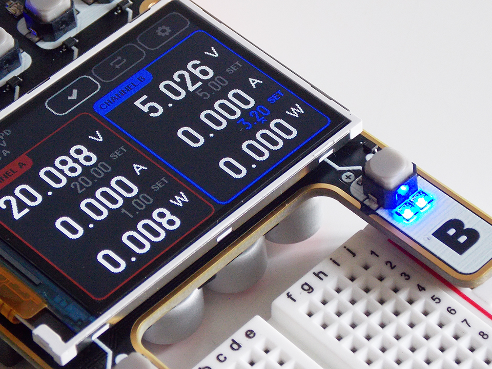
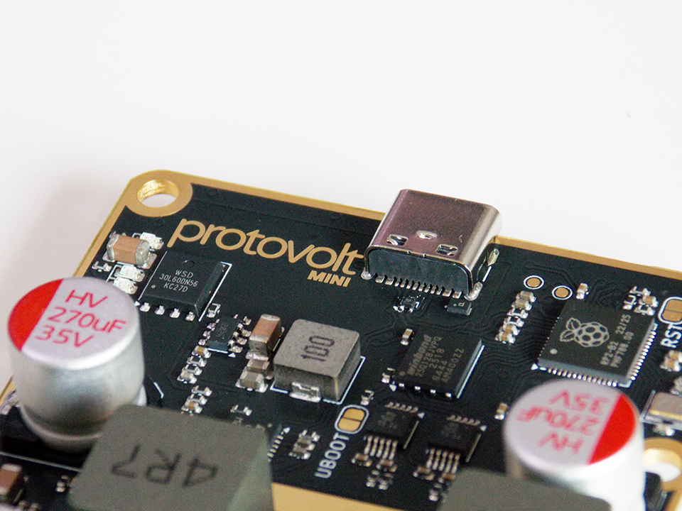
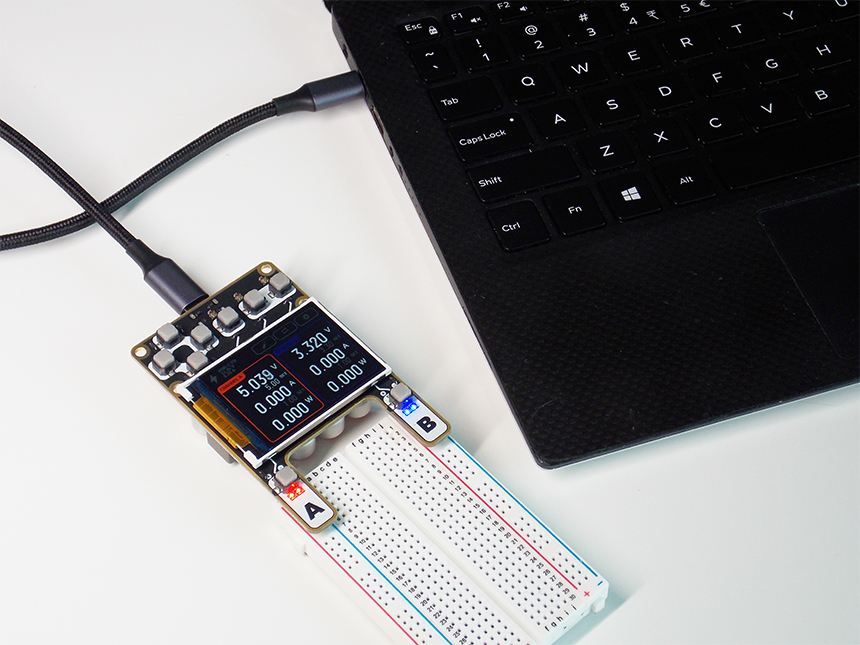

# Protovolt

**Protovolt MINI** is a dual-channel, USB-C powered, credit card-sized lab power supply for electronics prototyping and field testing. Designed for precision, portability, and rapid iteration.


## Features

- 🔌 Dual independent output channels
- ⚡ Powered via USB-C (PD)
- 📐 Credit-card sized
- 🖥️ Simple interactive buttons UI 
- 🧠 Embedded firmware written in Rust
- 📦 Packaged for standard breadboards
- ✏️ Open firmware and schematics

## Quick Specs

| Feature           | Description                        |
|-------------------|------------------------------------|
| Input Power       | USB-C PD 2.0, up to 100W           |
| Output Channels   | 2x adjustable outputs              |
| Channel Voltage   | 0–20V (steps of 10mV)              |
| Channel Current   | 0-5A (steps of 50mA)               |
| Size              | Normal card (85.5mm x 54mm x 18mm) |
| UI                | D-pad + control buttons            |
| Display           | 2.0in TFT (320x240 pixels)         |
| MCU               | RP2040                             |

## Hardware Overview

Protovolt's compact design includes dual power paths, each driven by a buck-boost converter. The USB-C PD input negotiates up to 100W of power, which can be delivered to the output rails. An onboard microcontroller handles the outputs, measurements, safety and the user interface.




## Compatibility

The MINI's footprint matches that of a standard credit card. The 2x5 pin headers with 2.54mm pitch, for each channel, mate with the power rails of BB400 and BB830 prototyping breadboards. At just 17.5mm tall, the Protovolt is palm-sized, and sits almost flush with the table.




## Directory Structure

The hardware is designed with [`Kicad v9.0`](https://www.kicad.org/), while the software runs on the [`Embassy`](https://embassy.dev/) embedded framework.

```
protovolt/
├── docs/ # Documentation and renders
├── hardware/ # KiCad design files
├── protovolt/ # Firmware (Rust + Embassy)
│ ├── src/ # Source tree root
│ ├── src/assets/ # Embedded assets
│ ├── hal/ # Hardware abstraction layer
│ └── ui/ # Display/UI logic
└── res/ # Logos and marketing assets
```

## Building

```bash
# Clone the Protovolt repository from GitHub
git clone https://github.com/ThatAquarel/protovolt.git

# Go to firmware directory
cd protovolt/protovolt
```

```bash
# Install required tools:
# - probe-rs: for flashing and debugging via SWD
# - elf2uf2-rs: to convert ELF binaries to UF2 format (for drag-and-drop USB flashing)
cargo install probe-rs elf2uf2-rs

# Add the target for Cortex-M0+ (RP2040)
rustup target add thumbv6m-none-eabi
```

### Flashing with SWD

Connect the three pads next to the crystal oscillator on the PCB with the following pinout to the SWD debugger:
- `D` Data
- `G` Ground
- `<` Clock

```bash
# Build and flash the firmware to the board using probe-rs
cargo run
```

### Flashing via USB
Short the `UBOOT` jumper while connecting the USB cable. Drag-and-drop generated `.uf2` file into the `RP2040` mass storage device.

```bash
# Build the firmware
cargo build --release

# Convert the output ELF file to UF2 format
elf2uf2-rs target/thumbv6m-none-eabi/release/protovolt target/thumbv6m-none-eabi/release/protovolt.uf2
```

## Gallery








## License

This project is open-source under the Eclipse Public License - v 2.0.


## Contact

Created and maintained by [Alex Xia](mailto:alex.xia@flakeblade.com). Contributions and bug reports welcome!

