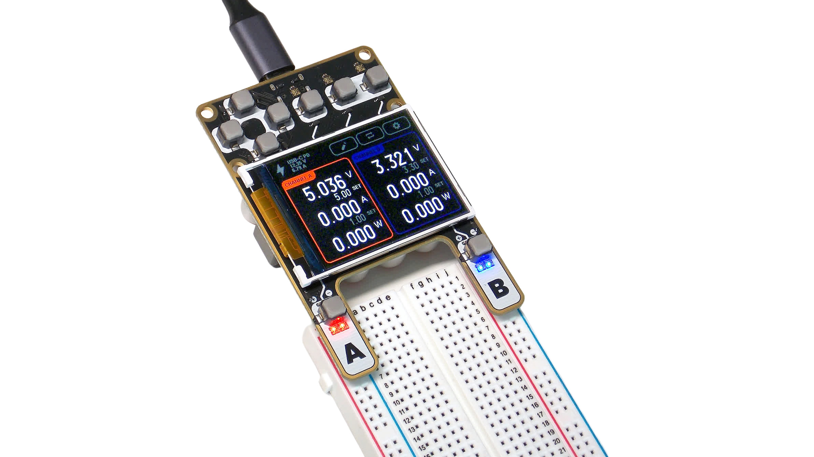
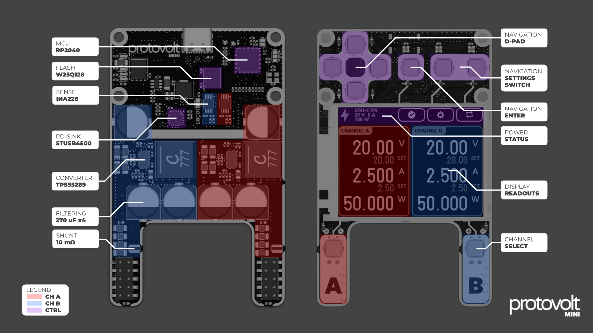
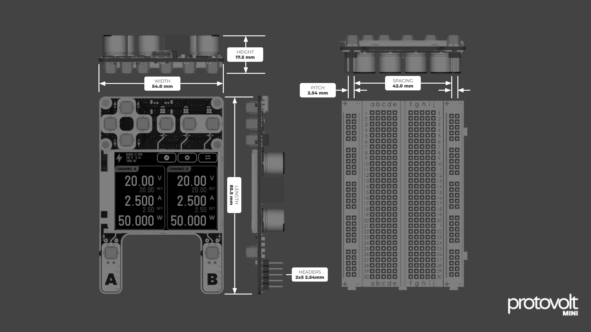
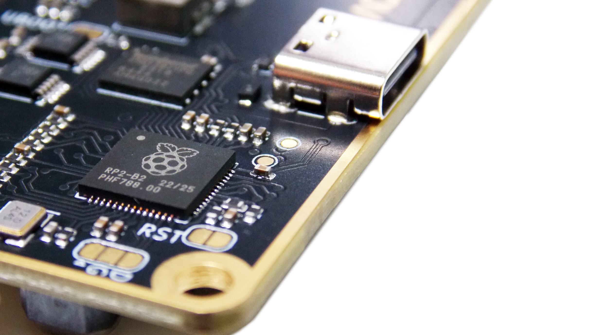
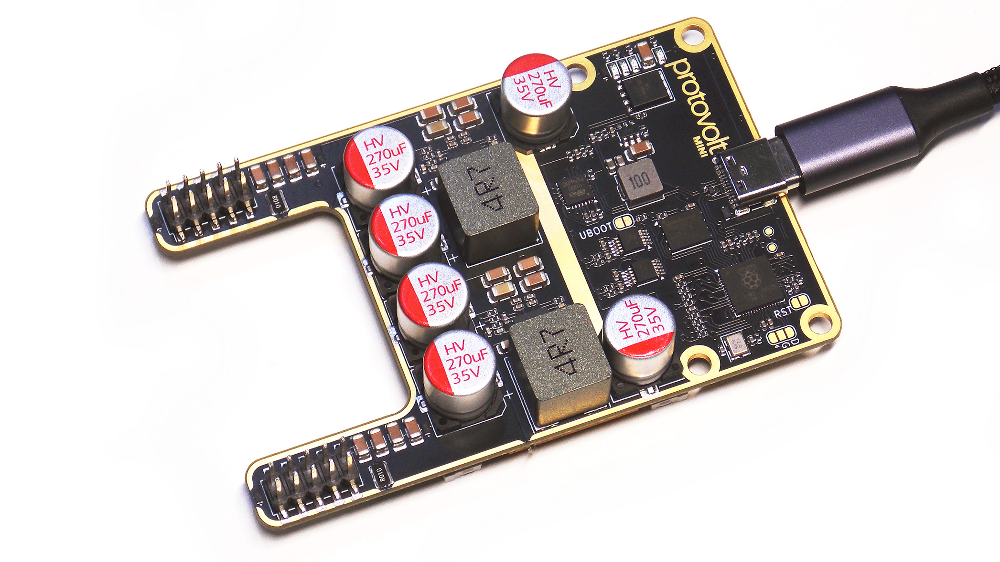
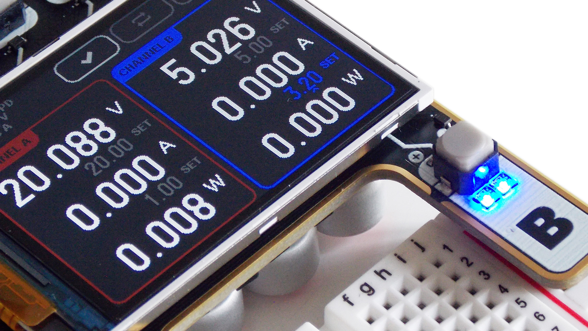

[![ProtoV MINI][cover]][website]

# Power that catalyzes the workspace

[![Release][release-badge]][release]
[![CI][ci-badge]][ci]
[![Chat][chat-badge]][chat]
[![CrowdSupply][cs-badge]][cs]


**ProtoV MINI** is a dual-channel, USB-C powered, credit card-sized lab power supply for electronics prototyping and field testing. Designed for precision, portability, and rapid iteration.

Follow along and be part of the adventure! Launching soon on [CrowdSupply][cs].



## Features

- 🔌 Dual independent output channels
- ⚡ Powered via USB-C (PD)
- 📐 Credit-card sized
- 🖥️ Simple interactive buttons UI 
- 🧠 Embedded firmware written in Rust
- 📦 Packaged for standard breadboards
- ✏️ Open firmware and schematics

## Quick Specs

| Feature           | Description                        |
|-------------------|------------------------------------|
| Input Power       | USB-C PD 2.0, up to 100W           |
| Output Channels   | 2x adjustable outputs              |
| Channel Voltage   | 0–20V (steps of 10mV)              |
| Channel Current   | 0-5A (steps of 50mA)               |
| Size              | Normal card (85.5mm x 54mm x 18mm) |
| UI                | D-pad + control buttons            |
| Display           | 2.0in TFT (320x240 pixels)         |
| MCU               | RP2040                             |

## Hardware Overview

Protovolt's compact design includes dual power paths, each driven by a buck-boost converter. The USB-C PD input negotiates up to 100W of power, which can be delivered to the output rails. An onboard microcontroller handles the outputs, measurements, safety and the user interface.




## Compatibility

The MINI's footprint matches that of a standard credit card. The 2x5 pin headers with 2.54mm pitch, for each channel, mate with the power rails of BB400 and BB830 prototyping breadboards. At just 17.5mm tall, the Protovolt is palm-sized, and sits almost flush with the table.




## Directory Structure

The hardware is designed with [`Kicad v10.0`](https://www.kicad.org/), while the firmware runs on the [`Embassy`](https://embassy.dev/) embedded framework.

```
protov/
├── Cargo.toml              # workspace manifest
├── Justfile                # common build, test, release, and mock commands
├── protov-core/            # host-testable application logic (no_std on device)
├── protov-hal/             # RP2040 firmware binary (`protov`)
├── protov-bootloader/      # embassy-boot RP2040 bootloader (A/B swap)
├── protov-nvm/             # flash layout, linker scripts, factory sector
├── protov-scpi/            # SCPI wire protocol (parse, encode, host client, WASM)
├── protov-hal-mock/        # WebSocket device simulator for lab app / e2e
├── hardware/               # KiCad design files (MINI)
├── docs/                   # documentation and product renders
├── scripts/                # FWUP upload helper, release signing helpers
├── dist/                   # release artifacts (built by `just release-bundle`)
└── res/                    # logos and marketing assets
```

### Workspace crates

| Crate | Role |
| --- | --- |
| **protov-core** | Product logic shared by firmware and host tests: app state machine, channel model, protection, USB-PD policy, DFU session, and SCPI command handling. Built `no_std` on device; exercised on the host with `test-harness` and hardware-revision features (`hw-a0`, `hw-a1`, `hw-a2`). |
| **protov-hal** | On-device firmware for the RP2040. Embassy executor, drivers, UI, and the `protov` binary that links `protov-core` to hardware. |
| **protov-bootloader** | Small RP2040 `embassy-boot` loader in the first flash slot. Manages ACTIVE/DFU/STATE partitions and swap-on-boot before jumping to the application. |
| **protov-nvm** | Single source of truth for the 2 MiB W25Q16 layout: linker scripts, partition constants, factory identity sector, FWUP size limits, and Ed25519 manifest verification. |
| **protov-scpi** | Authoritative SCPI parser/encoder and optional host client (`std`) used by tools, tests, and the web lab. Also builds to WASM for browser transports. |
| **protov-hal-mock** | Host-only ProtoV MINI simulator (`protov-mock`): WebSocket SCPI bridge plus a control port for lab-app end-to-end tests without hardware. |

Hardware revisions **A.0**, **A.1**, and **A.2** map to the `hw-a0`, `hw-a1`, and `hw-a2` Cargo features on `protov-core` and `protov-hal`. Build uses **A.1** by default (`just build`).

## Building

```bash
# Clone the repository
git clone https://github.com/flakeblade/protov.git
cd protov

# Install [just](https://github.com/casey/just) for common commands
# cargo install just
```

```bash
# Install required tools:
# - probe-rs: flash and debug over SWD
# - elf2uf2-rs: convert ELF to UF2 for drag-and-drop USB flashing
# - arm-none-eabi-objcopy: release .bin extraction (release-bundle)
cargo install probe-rs elf2uf2-rs

# Add the target for Cortex-M0+ (RP2040)
rustup target add thumbv6m-none-eabi
```

Run `just` (or `just --list`) from the repo root to see all recipes. Common tasks:

```bash
# Host tests and lint
just test          # protov-core (A.1) + protov-scpi
just test-a0       # protov-core with hw-a0
just test-a1       # protov-core with hw-a1
just test-a2       # protov-core with hw-a2
just test-scpi     # protov-scpi (std)
just test-mock     # protov-hal-mock
just test-nvm      # protov-nvm layout tests
just clippy        # protov-core, hw-a1
just fmt           # cargo fmt --all
just checks        # all of the above

# Firmware (default profile: production A.1)
just build         # same as build-a1
just build-a0      # Proto / A.0 boards
just build-a1      # production A.1 boards
just build-a2      # production A.2 boards
just run           # build and flash via probe-rs
just pkg           # build UF2 from the A.1 release ELF

# Bootloader (from repo root)
just bootloader::build
just bootloader::flash
just bootloader::pkg

# Lab simulator and browser SCPI
just build-mock
just run-mock
just scpi-wasm-build

# Release packaging (version without v prefix, e.g. 1.7.3)
just release-bundle 1.7.3

# Query identity over USB serial
just scpi-id /dev/ttyACM0
```

Local signing after a debug build:

```bash
just build
PRIVATE_KEY=... PUBLIC_KEY=... just sign-firmware
# or: PRIVATE_KEY=... just -f protov-hal/Justfile sign-all
```

### Flashing with SWD

Connect the three pads next to the crystal oscillator on the PCB with the following pinout to the SWD debugger:
- `D` Data
- `G` Ground
- `<` Clock

```bash
just run
```

### Flashing via USB

Short the `UBOOT` jumper while connecting the USB cable. Drag-and-drop the generated `.uf2` file into the RP2040 mass storage device.

```bash
just build
just pkg
# target/protov.uf2
```

For a full multi-profile release (`.elf`, `.bin`, `.uf2`, signed `.sign.bin`, manifest, tarball):

```bash
just release-bundle 1.7.3
# artifacts under dist/A.0, dist/A.1, dist/A.2
```

## Gallery





## License

This project is licensed under the [Eclipse Public License v2.0](LICENSE).

## Contact

Created and maintained by [Alex Xia](mailto:alex.xia@flakeblade.com). Contributions and bug reports welcome!


[release-badge]: https://github.com/flakeblade/protov/actions/workflows/release.yml/badge.svg
[release]: https://github.com/flakeblade/protov/actions/workflows/release.yml

[ci-badge]: https://github.com/flakeblade/protov/actions/workflows/ci.yml/badge.svg
[ci]: https://github.com/flakeblade/protov/actions/workflows/ci.yml

[chat-badge]: https://img.shields.io/badge/chat-discussions-success.svg
[chat]: https://github.com/flakeblade/protov/discussions

[cs-badge]: https://img.shields.io/badge/Crowd-Supply-099?labelColor=555
[cs]: https://www.crowdsupply.com/flake-and-blade-robotics-design/protov-mini

[cover]: res/protov_mini_cover.svg
[website]: https://protov.app
