# Interface guide

This guide walks through ProtoV MINI's on-device UI in the order you normally
encounter it. Each step links to a rendered example screen from
[`docs/res/ui/`](res/ui/) (generated from [`protov-hal-mock/states/`](../protov-hal-mock/states/)
via `just render-ui`). For a flat catalog of every render, see
[`ui-states.md`](ui-states.md).

ProtoV MINI has two **normal** operating paths:

| Path | Power | Host | Navbar (top-left) |
| --- | --- | --- | --- |
| [Standalone (PD only)](#standalone-usb-c-pd-only) | USB-C PD supply | None | Lightning icon, **USB PD** or **USB2.0**, negotiated W/V/A |
| [Computer linked](#computer-linked) | USB-C PD via OTG splitter | ProtoV App or SCPI | Link icon, **LINKED**, negotiated W/V/A |

Both paths share the same boot sequence and main-screen controls. The
[troubleshooting guide](troubleshooting.md) covers boot failures, protection
trips, and other fault screens.

## Controls

| Control | Navigation mode | Setpoint-edit mode |
| --- | --- | --- |
| **Channel A / B** | First press selects channel; second press on the selected channel enables output; third press disables output | Exits edit mode and selects the pressed channel |
| **Up / Down** | Toggle voltage vs current row for the selected channel | Increment / decrement the digit under the cursor |
| **Left / Right** | Move selection between Channel A and Channel B | Move the edit cursor across digits |
| **Enter** (pencil ✎ / check ✓) | Short press: enter setpoint edit for selected channel | Short press: confirm value and apply; toggles back to navigation |
| **Switch** (⇄) | Toggle **SET** (output setpoints) vs **LIMITS** (OVP/OCP) | Same toggle; edit mode is preserved |
| **Settings** (⚙) | Open / close settings overlay | Blocked while settings are open |

Factory default setpoints after boot: Channel A **5.00 V / 1.00 A**, Channel B
**3.30 V / 1.00 A**. Protection defaults: **20.0 V** OVP and **5.0 A** OCP per
channel ([`CH1_FACTORY` / `CH2_FACTORY`](../protov-core/src/config/channel.rs)).

---

## Boot sequence (both paths)

Applies every time power is applied. Steps advance automatically; no button
input is required during boot.

| Step | Screen | What it means |
| --- | --- | --- |
| 1 | 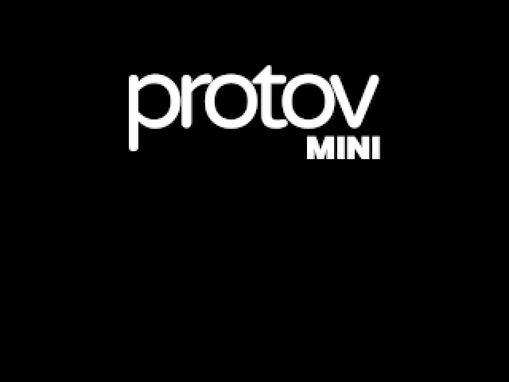 | Logo splash while firmware initializes |
| 2 |  or  | **INPUT** line confirms USB-C PD (✓) or standard 5 V USB (✗ on PD row). PD example shows negotiated **9.00 V / 3.00 A** in the navbar after main UI loads |
| 3 |  | **SENSE** calibration passed |
| 4 |  | **CONVERTER** self-test passed |

After step 4 the device enters the main interface. If sense or converter shows
**FAIL**, see [Boot self-check failures](troubleshooting.md#boot-self-check-failures).

---

## Standalone (USB-C PD only)

Use this path when ProtoV MINI is powered from a USB-C PD adapter and controlled
only from the front panel. Setup steps are in [Quick start — Option
1](quick_start.md#option-1-usb-c-pd-supply-only).

### 1. Standby main screen

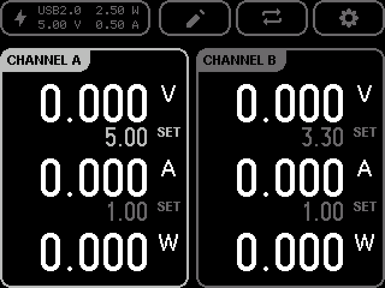

After boot, both outputs are off. Large readouts show **0.000**; **SET** rows
show factory setpoints. The navbar shows the negotiated input contract (example:
**USB2.0  2.50 W** and **5.00 V  0.50 A** for a 5 V / 0.5 A standard-USB
input).

**Verify:** Compare the navbar W/V/A with your supply rating. If you expected
**USB PD** but see **USB2.0**, see [Wrong power type at boot](troubleshooting.md#wrong-power-type-at-boot).

### 2. Select a channel

Press **Channel B** once (while Channel A is selected from boot).

- Channel B header highlights; output stays off.
- **Up / Down** now affect Channel B's voltage/current row selection.

Press **Left** to return selection to Channel A.

### 3. Choose voltage or current row

With a channel selected, **Up** selects the **voltage** row; **Down** selects the
**current** row. The active row is highlighted before editing.

### 4. Edit a setpoint

1. Press **Enter** → pencil icon becomes check; the selected row enters edit
   mode (red **SET** text and cursor).
2. **Left / Right** move the cursor across digits:

   | Cursor position | Example |
   | --- | --- |
   | Tens | 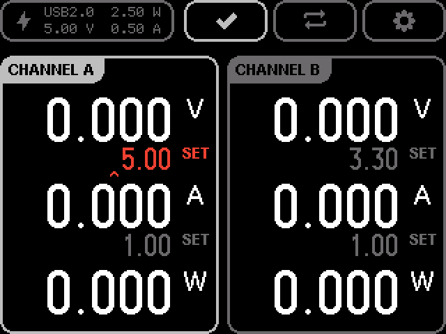 |
   | Ones |  |
   | Tenths |  |
   | Hundredths |  |

   For the **current** row:

   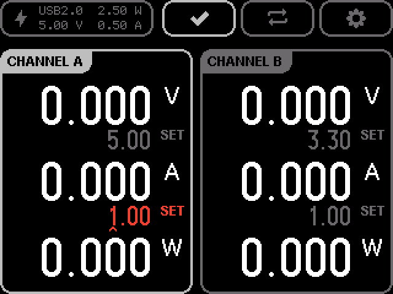

3. **Up / Down** increment or decrement the digit under the cursor.
4. Press **Enter** again to confirm and return to navigation mode.

Setpoint ranges: voltage **0.2–20.0 V** (10 mV steps), current **0–5.0 A** (50 mA
steps) — see [product specifications](product.md#specifications).

### 5. Enable output

1. Select the channel (**Channel A** or **Channel B** once if not already selected).
2. Press the same **channel button** again → output enables.

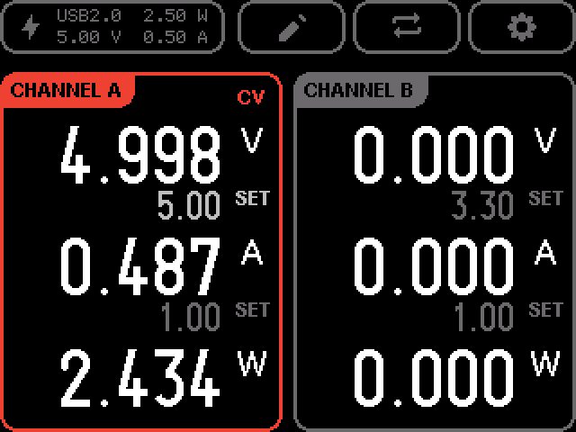

Large readouts show live measurements; a **CV** or **CC** chip appears when the
channel is regulating. Examples:

| Mode | Screen | When |
| --- | --- | --- |
| Constant voltage |  | Load draws less current than the limit; voltage holds at setpoint |
| Constant current |  | Load demands more current than the setpoint; current limits and voltage drops |

Press the **channel button** a third time to turn output off.

### 6. Run both channels

Enable Channel A, then select and enable Channel B:

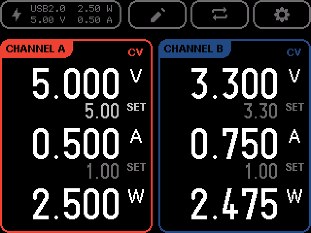

Total load must stay within the negotiated USB input power shown in the navbar.

### 7. Adjust protection limits (OVP / OCP)

1. Press **Switch** (⇄) → tags change from **SET** to **OVP** / **OCP**.

   

2. **Up / Down** choose voltage (OVP) or current (OCP) row.
3. **Enter** and edit with the same cursor controls as setpoints.
4. Press **Switch** again to return to **SET** mode.

Default limits are defined in [`protov-core/src/config/channel.rs`](../protov-core/src/config/channel.rs)
(`ovp`, `ocp` per channel). SCPI queries: `CH1:OVP?`, `CH1:OCP?` — see
[SCPI protocol](../protov-scpi/PROTOCOL.md#channel-queries).

### 8. Settings overlay

Press **Settings** (⚙) from the main screen:

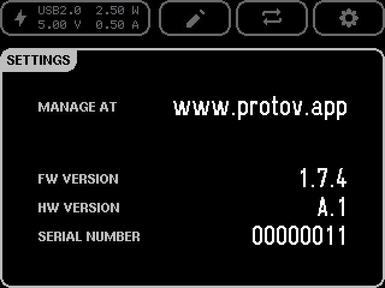

Shows firmware version, hardware revision, and serial number. Press **Settings**
again to close. Live readouts pause while settings are open.

---

## Computer linked

Use this path when a computer is connected through a USB-C OTG splitter while
PD power is supplied. Setup is in [Quick start — Option
2](quick_start.md#option-2-usb-c-pd-supply-and-computer).

### 1. Linked navbar

When the USB data link is active, the navbar shows the **link** icon and
**LINKED** instead of **USB PD** / **USB2.0**. Negotiated input W/V/A still
appear on the second line.

**Verify:** If ProtoV App cannot connect but power works, confirm **LINKED**
appears. See [Host not linked](troubleshooting.md#host-not-linked).

### 2. Remote control

With **LINKED**, [ProtoV App](https://protov.app) or SCPI can change setpoints,
outputs, and limits while the on-device UI mirrors state. Front-panel buttons
remain available unless the host holds remote lock (`SYST:REM`).

### 3. Custom channel colors

From ProtoV App or SCPI, set per-channel RGB colors (`CH1:COLR`, `CH2:COLR` in
[SCPI protocol](../protov-scpi/PROTOCOL.md#channel-configuration)):

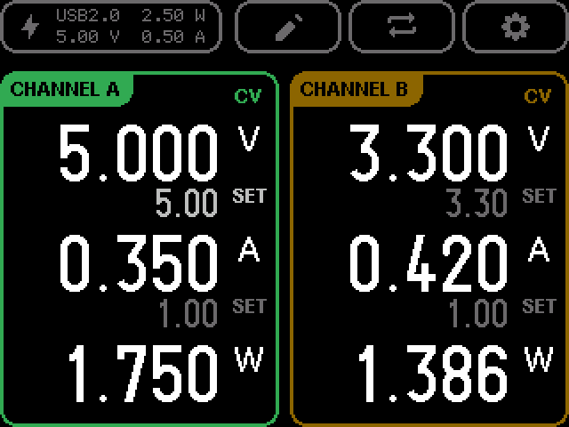

Example: Channel A green `52,168,83`, Channel B yellow `251,188,5`. Colors appear
on channel borders when that channel's output is enabled (or when selected with
output on). Factory defaults are red / blue
([`DEFAULT_CH1` / `DEFAULT_CH2`](../protov-core/src/config/appearance.rs)).

### 4. Same main-screen flow

Standby, setpoint edit, output enable, limits, and settings work the same as
[standalone](#standalone-usb-c-pd-only). Prefer the host for bulk changes; use
the panel for quick adjustments in the lab.

---

## Firmware update screens (host-initiated)

Firmware updates are normally started from ProtoV App or SCPI (`SYST:FWUP:STAR`).
On-device display during update:

| Phase | Screen |
| --- | --- |
| Preparing | 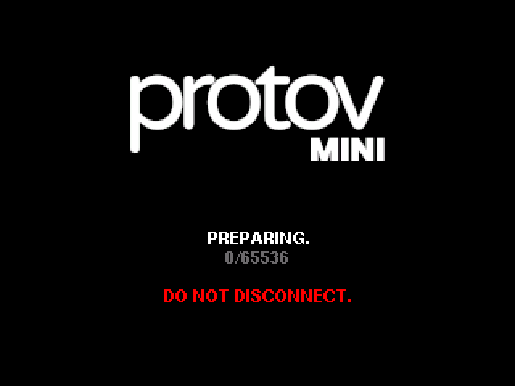 |
| Transferring |  |
| Verified | 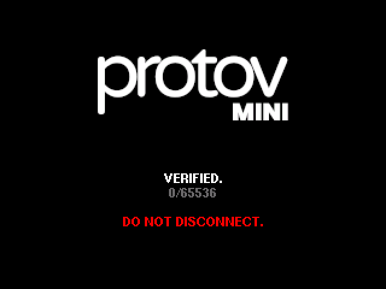 |
| Flashing | 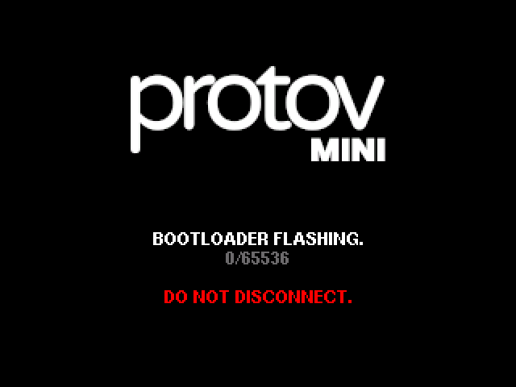 |

Do not disconnect power during transfer. If update fails, see
[Firmware update failed](troubleshooting.md#firmware-update-failed).

---

## Quick reference — button sequence cheat sheet

**Set Channel A to 5 V / 0.5 A and enable (from standby):**

1. Boot completes → standby.
2. **Up** (voltage row selected by default on Channel A).
3. **Enter** → edit voltage → adjust digits → **Enter** confirm.
4. **Down** → current row → **Enter** → adjust → **Enter** confirm.
5. **Channel A** → enable output.

**Adjust Channel A OVP:**

1. **Switch** → limits mode.
2. **Up** (OVP row) → **Enter** → edit → **Enter** confirm.
3. **Switch** → back to SET mode.

**Open settings:** **Settings** → read versions → **Settings** again to close.
