# Troubleshooting

This guide covers ProtoV MINI screens that indicate a fault, a failed check, or
misconfiguration. Each section links to example renders in
[`docs/res/ui/`](res/ui/). For the normal button-by-button flow, see the
[interface guide](interface_guide.md). For wiring and supply compatibility, see
[compatibility](compatibility.md).

---

## Boot self-check failures

During power-on, the splash screen accumulates three checks. Any **FAIL** stops
normal operation until power is cycled after the underlying issue is fixed.

| Screen | Check | Typical causes |
| --- | --- | --- |
|  | **SENSE** | Measurement path fault, hardware damage, marginal sense calibration |
| 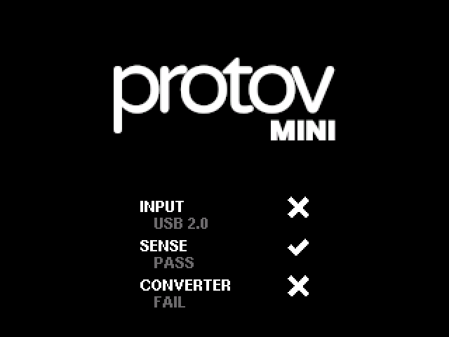 | **CONVERTER** | Power-stage self-test failure, input power inadequate for test, hardware fault |

**Passing references:**

- 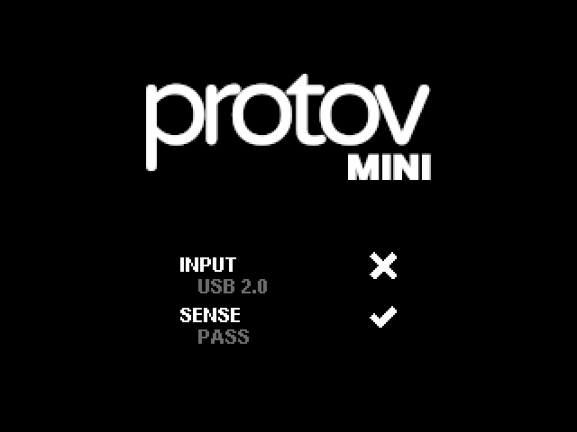
- 

**What to try:**

1. Disconnect all loads from output headers.
2. Power-cycle with a known-good [USB-C PD source](compatibility.md#usb-c-power-sources)
   and CC-capable cable ([quick start](quick_start.md)).
3. If failures persist across supplies, contact support with hardware revision
   (settings overlay or `*IDN?`) and serial number.

Sense/converter results are also exposed on the SCPI telemetry context
(`sense_ok`, `converter_ok` in [`ScpiContext`](../protov-core/src/scpi/mod.rs)).

---

## Wrong power type at boot

| Screen | Meaning |
| --- | --- |
| 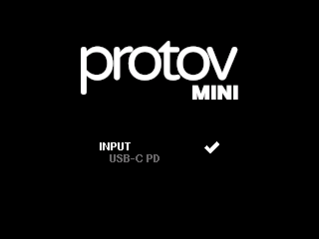 | PD contract negotiated (✓ on **USB-C PD** row) |
| 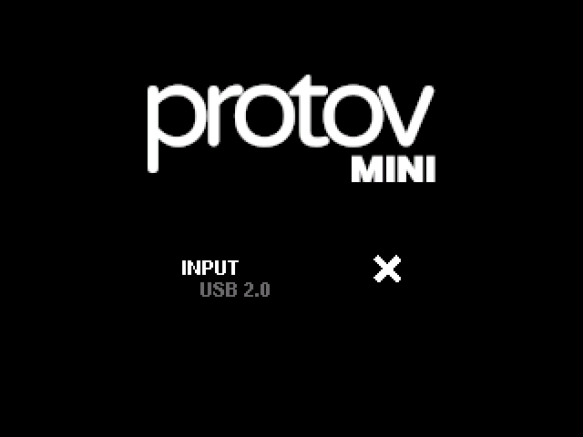 | Standard USB 5 V only (✗ on PD row) |

**Symptom:** Main UI navbar shows **USB2.0** but the supply is PD-capable, or
available output power is lower than expected.

**What to try:**

1. Use a USB-C cable with **Configuration Channel (CC)** wires — see [Quick
   start](quick_start.md#option-1-usb-c-pd-supply-only).
2. Confirm the supply and port support PD ([compatibility](compatibility.md#usb-c-power-sources)).
3. Reconnect the cable; try flipping the USB-C orientation on marginal cables.
4. With a computer link, use an OTG splitter and connect **PD first, then data,
   then the device** ([quick start — Option 2](quick_start.md#option-2-usb-c-pd-supply-and-computer)).

The navbar W/V/A lines reflect the **negotiated input contract**, not the channel
setpoints. Channel outputs cannot draw more total power than this contract allows.

---

## Host not linked

| Screen | Meaning |
| --- | --- |
| 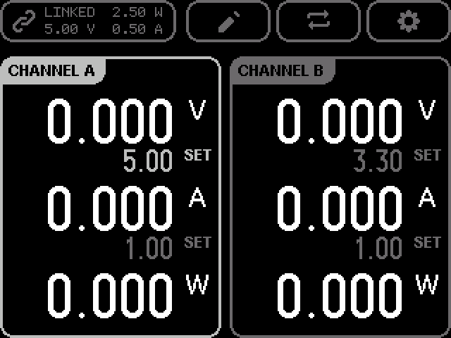 | USB data link active — **LINKED** in navbar |

**Symptom:** ProtoV App does not list the device, or SCPI/WebSocket tools cannot
connect, while power and the front panel work.

**What to try:**

1. Confirm the display shows **LINKED** (not just **USB PD**).
2. Connect the computer to the splitter's **data** port, not the PD-only port.
3. Use a [supported browser/OS](compatibility.md#protov-app).
4. Check USB cable data lines; charge-only cables will not link.
5. Close other apps that may hold the serial port.

---

## Limits mode and protection trips

### Editing limits

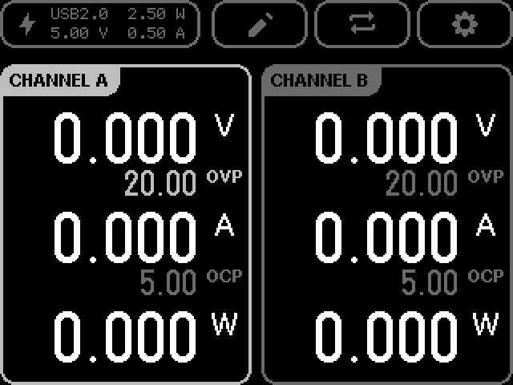

Press **Switch** (⇄) on the main screen to edit **OVP** (over-voltage) and
**OCP** (over-current) thresholds instead of output setpoints. The edit flow
matches SET mode: **Up/Down** select row, **Enter** to edit, **Left/Right** for
cursor, **Enter** to confirm.

Limits are stored per channel. Factory defaults: **20.0 V** OVP, **5.0 A** OCP
([`CH1_FACTORY` / `CH2_FACTORY`](../protov-core/src/config/channel.rs)).

SCPI:

| Command | Purpose |
| --- | --- |
| `CH1:OVP?` / `CH2:OVP?` | Query voltage limit |
| `CH1:OCP?` / `CH2:OCP?` | Query current limit |
| `CH1:OVP 12.0` | Set OVP (example) |

See [SCPI protocol — channel configuration](../protov-scpi/PROTOCOL.md).

### Protection latched (output shut off)

When a fault is detected, the channel output disables and a fault chip latches
until cleared. Large readouts may show **0.000** while the fault tag remains.

| Fault | Screen | Typical trigger |
| --- | --- | --- |
| Over-voltage |  | Output or input exceeded **OVP** setting; load dump, wiring fault |
| Over-current | 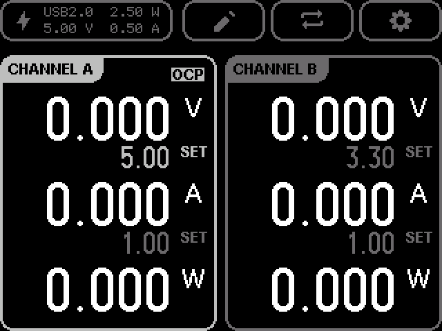 | Load drew more than **OCP** limit |
| Over-temperature | 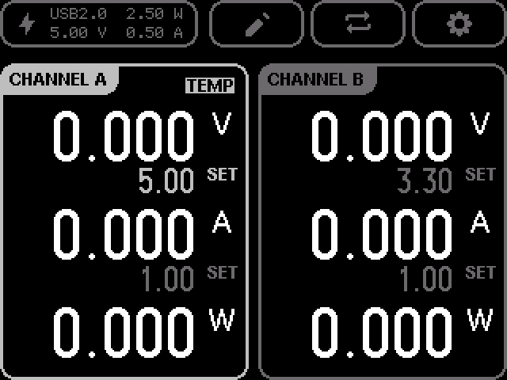 | Converter or board overheated |
| Short circuit |  | Very low impedance on output |

**What to try:**

1. **Power-cycle the device** — disconnect USB power, wait a few seconds, and
   reconnect a stable supply. A reboot clears many latched protection states
   once the underlying fault is gone.
2. **Remove the fault condition** — disconnect load, fix wiring, lower setpoints
   or limits if misconfigured. For **TEMP**, allow the board to cool before and
   after the reboot; the latch may remain until the converter is below the
   over-temperature threshold again.
3. **Clear the latch** (if the fault chip persists after power-cycle):
   - From ProtoV App or SCPI: `OUTP:RESET:PROT` (all channels) or
     `OUTP:RESET:PROT CH1` / `CH2` ([SCPI protocol](../protov-scpi/PROTOCOL.md)).
   - Factory reset `*RST` clears protection but restores all settings to factory
     defaults — use with care.
4. Re-enable the channel from the front panel (**channel button**) once the
   latch is cleared and conditions are safe.

**Prevention:**

- Set OVP/OCP above expected operating points but below hardware maximums
  ([product specifications](product.md#specifications): 0–20 V, 0–5 A).
- Avoid hot-plugging heavy capacitive loads.
- Ensure adequate cooling and input power headroom in the navbar.

Query latched state: `CH1:MODE?` returns `OVP`, `OCP`, `TEMP`, `SHORT`, `CV`,
`CC`, or `OFF`.

---

## Output behaves unexpectedly (not a fault screen)

These are normal operating modes that are often mistaken for errors:

| Screen | Meaning |
| --- | --- |
| 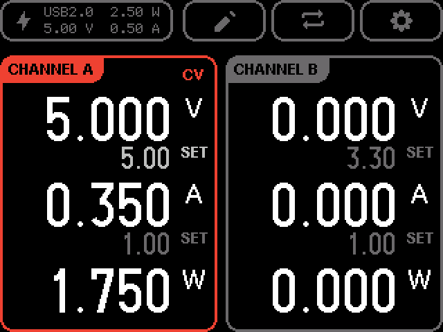 | **CV** — regulating voltage; current below limit |
| 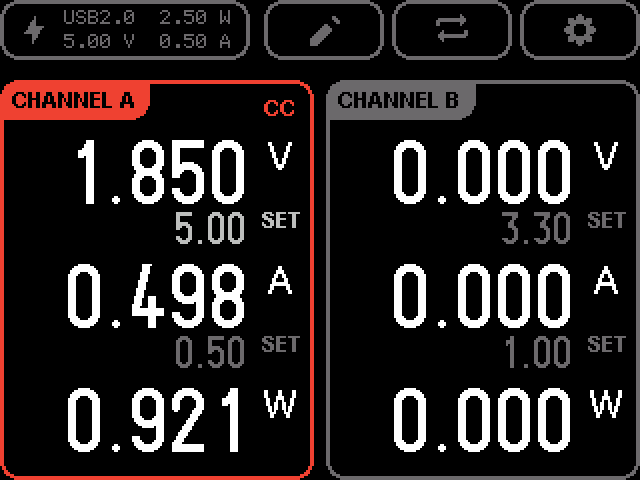 | **CC** — current at setpoint; voltage dropped to satisfy load |

If voltage is lower than the setpoint under load, the channel is in **CC**, not
failed CV. Raise the current setpoint or reduce load.

---

## Firmware update failed

| Phase | Screen |
| --- | --- |
| Failed | 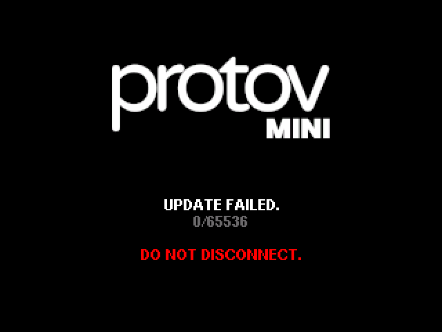 |
| (success path) | [Preparing → Transferring → Verified → Flashing](interface_guide.md#firmware-update-screens-host-initiated) |

**What to try:**

After a failed upload, the **bootloader recovers automatically** — you do not
need to enter recovery mode immediately.

1. Disconnect and reconnect a **stable** USB-C PD power source (or power cycle
   through your OTG splitter if a computer is linked).
2. The display may stay **blank for up to 120 seconds** while the bootloader
   validates and restores the previous firmware image.
3. Wait for the normal boot sequence (splash → input check → sense → converter →
   main UI). Do not disconnect power during this window.
4. Once boot completes, retry the update from ProtoV App or SCPI after
   `SYST:FWUP:STAT?` reports `IDLE`. Use a signed firmware bundle from a
   [release](releases.md) matching your hardware revision.
5. If the display remains blank for **more than 120 seconds**, or the device
   does not reach the main UI, proceed with manual recovery via USB BOOTSEL or
   SWD — see [flashing](flashing.md).

---

## SCPI and settings conflicts

Protection and remote-control operations may push errors to the SCPI queue while
the front panel shows a latched fault. Example from the OVP preset:
`-221,"Settings conflict"`.

Check errors with `SYST:ERR?`. Resolve remote vs local conflicts with
`SYST:LOC` / `SYST:REM` as appropriate ([SCPI protocol](../protov-scpi/PROTOCOL.md)).

---

## When nothing works — checklist

| Check | Action |
| --- | --- |
| No display | Verify PD supply, cable CC, try another port/cable |
| Boot loops on FAIL | [Boot self-check failures](#boot-self-check-failures) |
| **USB2.0** instead of PD | [Wrong power type](#wrong-power-type-at-boot) |
| No **LINKED** | [Host not linked](#host-not-linked) |
| Output won't turn on | Protection latched? Run `OUTP:RESET:PROT` after fixing fault |
| Output low voltage | [CC mode](#output-behaves-unexpectedly-not-a-fault-screen) or input power limit in navbar |
| App settings don't stick | Host in remote mode; check `SYST:ERR?` for `-221` conflicts |

For hardware dimensions, revision identification, and design files, see
[hardware](hardware.md). For development and mock-server testing of these UI
states, see [`protov-hal-mock`](../protov-hal-mock/README.md).
